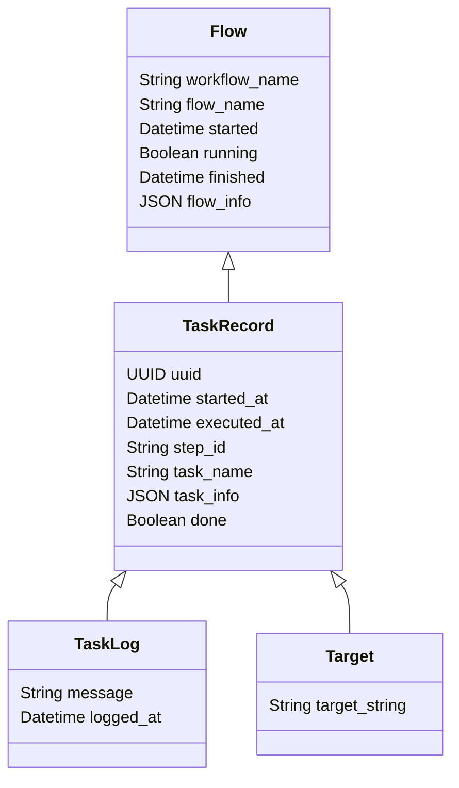

# Django Workflow Engine

## Model structure

## How are the models used?

### Flow

The Flow model is used to store information about a workflow. You will need to create a new Flow object for each workflow you want to run.

When executed, the Flow object will look at the workflow_name and follow the steps outlined on that workflow.

### TaskRecord

The TaskRecord model is used to store information about workflow steps they are created when a step is executed.

Once the Step has finished executing, the TaskRecord is updated with the results of the execution.

Currently, TaskRecord objects are created for each execution, meaning that if a step doesn't complete successfully, and is executed again, a new TaskRecord is created.

### Target

After a step has been executed a Targets are created that will determine which steps need to be executed next.

### TaskLog

TaskLogs are currently not used by Django Workflow Engine, but they can be useful for adding messages to TaskRecords.
